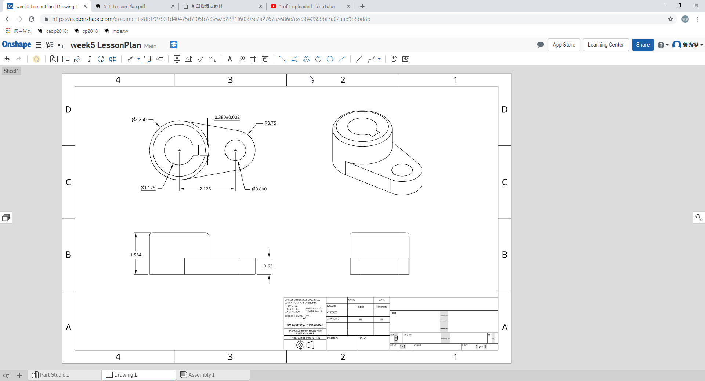

---
Title: Week8
Date: 2018-11-02 9:00
Category: Misc
Tags: 2018Fall
Slug: 2018-FallProject-8
Author: 40623154
----

學習Onshape基本用法

<!-- PELICAN_END_SUMMARY -->

學習內容
----

1. 如何使用工程圖
2. 做擺圖, 標尺寸, 公差, 註解等等
3. 設計零件的排版格式

</img>

學習心得
----
今天嘗試擺工程圖, 雖然標出來的尺寸跟之前學過的繪圖軟體有些微差別, 不過還是能夠理解要表示的東西, 而有些尺寸和公差標不太出來, 但可以用另一種方式標註, 大致上沒有什麼問題.